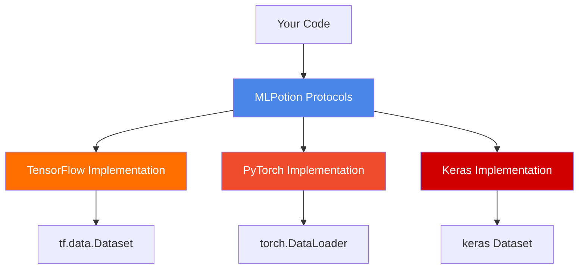

# Core Concepts 🧠

Understanding MLPotion's architecture will make you a more effective potion brewer. Let's dive into the key concepts!

## Design Philosophy 🎯

MLPotion is built on a foundation of **modularity, reusability, and extensibility**. Our design philosophy centers on providing composable building blocks that work seamlessly across frameworks and MLOps platforms.

### Core Pillars

1. **Modularity First**: Small, composable, reusable building blocks
   - Each component has a single, well-defined responsibility
   - Components can be mixed and matched freely
   - No monolithic frameworks or rigid hierarchies
   - Build complex workflows from simple pieces

2. **Framework Agnostic**: Works with TensorFlow, PyTorch, Keras with identical APIs
   - Write code once, use it with any framework
   - Same patterns, same interfaces, different implementations
   - Framework-specific optimizations under the hood
   - Easy migration between frameworks

3. **Community Extensible**: Easy to add new frameworks, new integrations
   - **ZenML is just one integration** - extend to Prefect, Airflow, Kubeflow, or any orchestrator
   - Protocol-based design makes adding new components straightforward
   - No vendor lock-in - use what works for your team
   - **Community contributions welcome** - see [Contributing Guide](../contributing/overview.md)

4. **Protocol-Based**: Type-safe, flexible design using Python protocols
   - Interfaces over inheritance
   - Duck typing with type safety
   - Framework-specific types preserved
   - IDE autocomplete and static type checking

## The Big Picture 🖼️

MLPotion provides a consistent interface across different ML frameworks:



## The Protocol Pattern 🎯

At MLPotion's heart are **Protocols** - Python's way of saying "I don't care what you are, just what you can do."

### What's a Protocol?

```python
from typing import Protocol

class DataLoader(Protocol):
    """I don't care HOW you load data, just that you CAN."""

    def load(self) -> Dataset:
        """Load and return a dataset."""
        ...
```

Any class with a `load()` method satisfies this protocol!

### Why Protocols?

**Without protocols (the old way):**

```python
# Rigid inheritance - eww!
class BaseDataLoader(ABC):
    @abstractmethod
    def load(self) -> Dataset:
        pass

class TFDataLoader(BaseDataLoader):  # Must inherit
    def load(self) -> tf.data.Dataset:
        # Implementation
        pass
```

**With protocols (the MLPotion way):**

```python
# Duck typing with type safety!
class TFDataLoader:  # No inheritance needed!
    def load(self) -> tf.data.Dataset:
        # Implementation
        pass

# Type checker knows this works!
loader: DataLoader = TFDataLoader()  # ✅ Type safe!
```

**Benefits:**

- No forced inheritance
- Framework-specific types preserved
- IDE autocomplete works perfectly
- Mix and match components easily

## Cross-Framework Example 🔄

See how the **same pattern** works across all frameworks:

```python
# TensorFlow
from mlpotion.frameworks.tensorflow import TFCSVDataLoader, TFModelTrainer

loader = TFCSVDataLoader(file_pattern="data.csv", label_name="target", batch_size=32)
dataset = loader.load()  # Returns tf.data.Dataset
trainer = TFModelTrainer()
result = trainer.train(model, dataset, config)

# PyTorch
from mlpotion.frameworks.pytorch import PyTorchCSVDataset, PyTorchModelTrainer

dataset = PyTorchCSVDataset(file_pattern="data.csv", label_name="target")
loader = DataLoader(dataset, batch_size=32)  # Returns torch.utils.data.DataLoader
trainer = PyTorchModelTrainer()
result = trainer.train(model, loader, config)

# Keras
from mlpotion.frameworks.keras import KerasCSVDataLoader, KerasModelTrainer

loader = KerasCSVDataLoader(file_pattern="data.csv", label_name="target", batch_size=32)
dataset = loader.load()  # Returns keras-compatible dataset
trainer = KerasModelTrainer()
result = trainer.train(model, dataset, config)
```

**Same concepts, same API, different frameworks!**

## Extending MLPotion 🔧

MLPotion is designed for community extensibility:

### Adding New Integrations

Want to integrate with **Prefect**, **Airflow**, or **Kubeflow**? Just wrap MLPotion components:

```python
# Example: Creating Prefect tasks
from prefect import task
from mlpotion.frameworks.tensorflow import TFCSVDataLoader, TFModelTrainer

@task
def load_data_task(file_pattern: str):
    loader = TFCSVDataLoader(file_pattern=file_pattern, ...)
    return loader.load()

@task
def train_model_task(model, dataset, config):
    trainer = TFModelTrainer()
    return trainer.train(model, dataset, config)

# Use in Prefect flow
from prefect import flow

@flow
def ml_flow():
    dataset = load_data_task("data.csv")
    result = train_model_task(model, dataset, config)
    return result
```

### Adding New Frameworks

Want to add support for **JAX**, **MXNet**, or another framework? Implement the protocols:

```python
from mlpotion.core.protocols import DataLoader, ModelTrainer

class JAXDataLoader:
    """Implements DataLoader protocol for JAX."""
    def load(self) -> jax.Array:
        # Your JAX-specific implementation
        return jax_array

class JAXModelTrainer:
    """Implements ModelTrainer protocol for JAX."""
    def train(self, model, dataset, config, validation_dataset=None):
        # Your JAX-specific training logic
        return TrainingResult(...)
```

See [Contributing Guide](../contributing/overview.md) to add your integration!

## Core Components 🧩

MLPotion has 6 main component types:

### 1. Data Loaders 📥

**Purpose:** Load data from various sources into framework-specific formats.

**Protocol:**

```python
class DataLoader(Protocol[DatasetT]):
    def load(self) -> DatasetT:
        """Load data and return a dataset."""
        ...
```

**Implementations:**

```python
# TensorFlow
TFCSVDataLoader → tf.data.Dataset
TFParquetLoader → tf.data.Dataset

# PyTorch
PyTorchCSVDataset → torch.utils.data.Dataset
PyTorchDataLoaderFactory → torch.utils.data.DataLoader

# Keras
KerasCSVDataLoader → keras dataset
```

**Example:**

```python
from mlpotion.frameworks.tensorflow import TFCSVDataLoader

loader = TFCSVDataLoader(
    file_pattern="data.csv",
    label_name="target",
    batch_size=32,
)
dataset = loader.load()  # Returns tf.data.Dataset
```

### 2. Dataset Optimizers ⚡

**Purpose:** Optimize datasets for training/inference performance.

**Protocol:**

```python
class DatasetOptimizer(Protocol[DatasetT]):
    def optimize(self, dataset: DatasetT) -> DatasetT:
        """Optimize dataset for performance."""
        ...
```

**What they do:**

- Batching
- Caching
- Prefetching
- Shuffling
- Parallelization

**Example:**

```python
from mlpotion.frameworks.tensorflow import TFDatasetOptimizer

optimizer = TFDatasetOptimizer(
    batch_size=32,
    shuffle_buffer_size=1000,
    cache=True,
    prefetch=True,
)

optimized_dataset = optimizer.optimize(dataset)
```

### 3. Model Trainers 🎓

**Purpose:** Train models with a consistent interface.

**Protocol:**

```python
class ModelTrainer(Protocol[ModelT, DatasetT]):
    def train(
        self,
        model: ModelT,
        dataset: DatasetT,
        config: TrainingConfig,
        validation_dataset: DatasetT | None = None,
    ) -> TrainingResult[ModelT]:
        """Train a model and return results."""
        ...
```

**What they handle:**

- Model compilation
- Training loop
- Validation
- Callbacks
- History tracking
- Early stopping

**Example:**

```python
from mlpotion.frameworks.tensorflow import TFModelTrainer, TFTrainingConfig

trainer = TFModelTrainer()
config = TFTrainingConfig(
    epochs=10,
    learning_rate=0.001,
    early_stopping=True,
)

result = trainer.train(model, dataset, config)
print(f"Final loss: {result.metrics['loss']}")
```

### 4. Model Evaluators 📊

**Purpose:** Evaluate trained models consistently.

**Protocol:**

```python
class ModelEvaluator(Protocol[ModelT, DatasetT]):
    def evaluate(
        self,
        model: ModelT,
        dataset: DatasetT,
        config: EvaluationConfig,
    ) -> EvaluationResult:
        """Evaluate model and return metrics."""
        ...
```

**What they provide:**

- Metric computation
- Performance analysis
- Result objects

**Example:**

```python
from mlpotion.frameworks.tensorflow import TFModelEvaluator

evaluator = TFModelEvaluator()
result = evaluator.evaluate(model, test_dataset, config)
print(f"Test accuracy: {result.metrics['accuracy']:.2%}")
```

### 5. Model Persistence 💾

**Purpose:** Save and load models reliably.

**Protocol:**

```python
class ModelPersistence(Protocol[ModelT]):
    def save(
        self,
        model: ModelT,
        path: str,
        **kwargs: Any
    ) -> None:
        """Save model to disk."""
        ...

    def load(self, path: str, **kwargs: Any) -> tuple[ModelT, dict[str, Any]]:
        """Load model from disk.

        Returns:
            Tuple of (loaded model, inspection metadata)
        """
        ...
```

**What they handle:**

- Model serialization
- Metadata preservation
- Model inspection on load
- Version compatibility
- Path management

**Example:**

```python
from mlpotion.frameworks.tensorflow import TFModelPersistence

persistence = TFModelPersistence()

# Save
persistence.save(model, "models/my_model")

# Load - returns tuple of (model, metadata)
loaded_model, metadata = persistence.load("models/my_model")
print(f"Model inputs: {metadata['inputs']}")
print(f"Model outputs: {metadata['outputs']}")
```

### 6. Model Exporters 📤

**Purpose:** Export models for production deployment.

**Protocol:**

```python
class ModelExporter(Protocol[ModelT]):
    def export(
        self,
        model: ModelT,
        export_path: str,
        config: ExportConfig,
    ) -> ExportResult:
        """Export model for serving."""
        ...
```

**Export formats:**

- TensorFlow: SavedModel, TFLite, TF.js
- PyTorch: TorchScript, ONNX
- Keras: Keras format, ONNX

**Example:**

```python
from mlpotion.frameworks.tensorflow import TFModelExporter, TFExportConfig

exporter = TFModelExporter()
config = TFExportConfig(format="saved_model")

result = exporter.export(model, "exports/model", config)
print(f"Exported to: {result.export_path}")
```

## Configuration Objects ⚙️

MLPotion uses Pydantic-based config objects for type safety and validation.

### Training Configuration

```python
from mlpotion.frameworks.tensorflow import TFTrainingConfig

config = TFTrainingConfig(
    # Required
    epochs=10,
    learning_rate=0.001,

    # Optimizer
    optimizer_type="adam",  # or "sgd", "rmsprop", etc.
    optimizer_kwargs={"beta_1": 0.9, "beta_2": 0.999"},

    # Loss and metrics
    loss="mse",  # or custom loss
    metrics=["mae", "mse"],

    # Training behavior
    batch_size=32,
    validation_split=0.2,
    shuffle=True,
    verbose=1,

    # Callbacks
    early_stopping=True,
    early_stopping_patience=10,
    early_stopping_monitor="val_loss",

    # Checkpointing
    save_best_only=True,
    checkpoint_monitor="val_loss",
)
```

**Benefits:**

- Type checking at creation time
- Validation before training
- IDE autocomplete for all options
- Serializable for reproducibility

### Result Objects 📋

All operations return rich result objects:

#### TrainingResult

```python
@dataclass
class TrainingResult(Generic[ModelT]):
    model: ModelT                           # Trained model
    history: dict[str, list[float]]         # Training history
    metrics: dict[str, float]               # Final metrics
    config: TrainingConfig                  # Configuration used
    training_time: float | None             # Training duration
    best_epoch: int | None                  # Best epoch (if early stopping)

# Usage
result = trainer.train(...)
print(f"Loss: {result.metrics['loss']}")
print(f"Training time: {result.training_time}s")
print(f"Best epoch: {result.best_epoch}")

# Access history
losses = result.history['loss']
val_losses = result.history['val_loss']
```

#### EvaluationResult

```python
@dataclass
class EvaluationResult:
    metrics: dict[str, float]              # Evaluation metrics
    config: EvaluationConfig               # Configuration used
    evaluation_time: float | None          # Evaluation duration

# Usage
result = evaluator.evaluate(...)
accuracy = result.get_metric('accuracy')
```

#### ExportResult

```python
@dataclass
class ExportResult:
    export_path: str                       # Where model was saved
    format: str                            # Export format used
    config: ExportConfig                   # Configuration used
    metadata: dict[str, Any]               # Additional info

# Usage
result = exporter.export(...)
print(f"Model saved to: {result.export_path}")
print(f"Format: {result.format}")
```

## Type Safety 🛡️

MLPotion uses Python 3.10+ type hints for maximum safety:

### Generic Types

```python
from typing import TypeVar, Generic

ModelT = TypeVar("ModelT")
DatasetT = TypeVar("DatasetT")

class Trainer(Generic[ModelT, DatasetT]):
    def train(
        self,
        model: ModelT,
        dataset: DatasetT,
    ) -> TrainingResult[ModelT]:
        ...
```

**What this means:**

```python
# TensorFlow
tf_trainer: Trainer[tf.keras.Model, tf.data.Dataset]
tf_result: TrainingResult[tf.keras.Model]

# PyTorch
torch_trainer: Trainer[nn.Module, DataLoader]
torch_result: TrainingResult[nn.Module]
```

Your IDE knows the exact types!

### Runtime Checking

```python
from mlpotion.core.protocols import DataLoader

# This is checked at runtime!
if isinstance(my_loader, DataLoader):
    dataset = my_loader.load()
```

## Error Handling 🚨

MLPotion has a consistent exception hierarchy:

```python
MLPotionError                    # Base exception
├── DataLoadingError            # Data loading issues
├── TrainingError               # Training failures
├── EvaluationError             # Evaluation problems
├── ExportError                 # Export issues
└── ConfigurationError          # Invalid configuration
```

**Usage:**

```python
from mlpotion.core import DataLoadingError, TrainingError

try:
    dataset = loader.load()
    result = trainer.train(model, dataset, config)
except DataLoadingError as e:
    print(f"Failed to load data: {e}")
except TrainingError as e:
    print(f"Training failed: {e}")
```

## Framework Detection 🔍

MLPotion auto-detects available frameworks:

```python
from mlpotion.utils import is_framework_available, get_available_frameworks

# Check if a framework is available
if is_framework_available("tensorflow"):
    from mlpotion.frameworks.tensorflow import TFCSVDataLoader
    # Use TensorFlow components

# Get all available frameworks
frameworks = get_available_frameworks()
print(f"Available: {frameworks}")  # ['tensorflow', 'torch']
```

## Composition Pattern 🔗

MLPotion components compose naturally:

```python
# Load data
loader = TFCSVDataLoader(...)
dataset = loader.load()

# Optimize
optimizer = TFDatasetOptimizer(...)
dataset = optimizer.optimize(dataset)

# Train
trainer = TFModelTrainer()
result = trainer.train(model, dataset, config)

# Evaluate
evaluator = TFModelEvaluator()
metrics = evaluator.evaluate(result.model, dataset, config)

# Export
exporter = TFModelExporter()
export_result = exporter.export(result.model, "path/", export_config)
```

Each component does one thing well, and they work together seamlessly!

## ZenML Integration 🔄

MLPotion provides **ready-to-use ZenML steps** for seamless MLOps integration:

```python
from zenml import pipeline
from mlpotion.integrations.zenml.tensorflow.steps import (
    load_data,
    optimize_data,
    train_model,
    evaluate_model,
    export_model,
)

@pipeline
def ml_pipeline():
    # Load data into tf.data.Dataset
    dataset = load_data(
        file_path="data.csv",
        batch_size=32,
        label_name="target",
    )

    # Optimize dataset for training
    dataset = optimize_data(
        dataset=dataset,
        prefetch=True,
        cache=True,
    )

    # Train model
    trained_model, history = train_model(
        model=model,
        dataset=dataset,
        epochs=10,
        learning_rate=0.001,
    )

    # Evaluate
    metrics = evaluate_model(
        model=trained_model,
        dataset=dataset,
    )

    # Export for serving
    export_path = export_model(
        model=trained_model,
        export_path="models/my_model",
        export_format="keras",
    )

    return metrics, export_path
```

**What you get:**

- Automatic artifact tracking
- Pipeline reproducibility
- Version control for models and datasets
- Caching of unchanged steps
- Full lineage tracking

**Important:** ZenML is just one integration! You can extend MLPotion to work with **Prefect**, **Airflow**, **Kubeflow**, or any other orchestrator. See [Extending MLPotion](#extending-mlpotion-) above.

## Design Patterns 🎨

### Strategy Pattern

Different implementations of the same protocol:

```python
# All implement DataLoader protocol
loaders = [
    TFCSVDataLoader(...),
    TFParquetLoader(...),
    TFBigQueryLoader(...),
]

# Use any of them interchangeably
for loader in loaders:
    dataset = loader.load()  # Works with all!
```

### Factory Pattern

Create complex objects easily:

```python
from mlpotion.frameworks.pytorch import PyTorchDataLoaderFactory

factory = PyTorchDataLoaderFactory(
    batch_size=32,
    shuffle=True,
    num_workers=4,
)

# Create dataloaders for different datasets
train_loader = factory.load(train_dataset)
val_loader = factory.load(val_dataset)
test_loader = factory.load(test_dataset)
```

### Builder Pattern

Complex configuration:

```python
config = (TFTrainingConfig()
    .with_epochs(10)
    .with_learning_rate(0.001)
    .with_early_stopping(patience=5)
    .with_checkpointing(save_best_only=True)
    .build())
```

(Note: This is conceptual; actual API uses direct construction)

## Next Steps 🚀

Now that you understand the concepts:

1. **[TensorFlow Guide →](../frameworks/tensorflow.md)** - TensorFlow-specific details
2. **[PyTorch Guide →](../frameworks/pytorch.md)** - PyTorch-specific details
3. **[Keras Guide →](../frameworks/keras.md)** - Keras-specific details
4. **[ZenML Integration →](../integrations/zenml.md)** - Add MLOps powers

## Key Takeaways 📝

- **Protocols > Inheritance**: Flexible, type-safe interfaces
- **Composition > Configuration**: Build by combining components
- **Type Safety**: Catch errors early with mypy
- **Consistency**: Same patterns across all frameworks
- **Simplicity**: Each component does one thing well

---

<p align="center">
  <strong>Concepts mastered! Time to dive deeper!</strong> 🧙‍♂️
</p>
